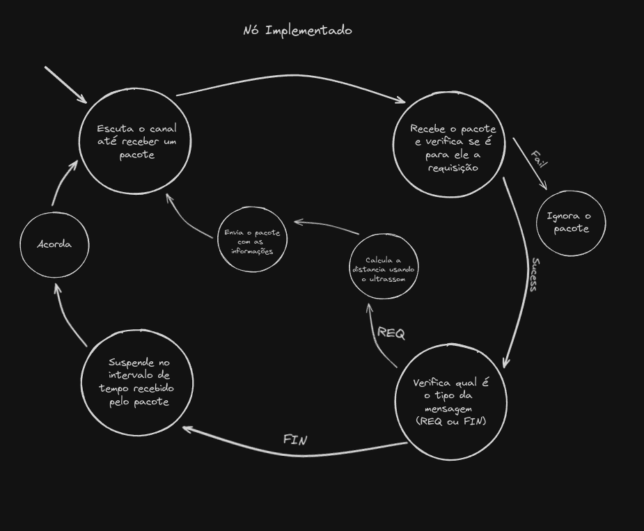

# Relatório do Projeto - Grupo 11

- Paulo Fernando Vilarim - 211043351
- Pedro Eduardo Cunha Ximenes - 200026071

## Resumo

O objetivo deste projeto é desenvolver um sistema de monitoramento remoto para tanques de combustível, utilizando a tecnologia de comunicação LoRa e dispositivos Arduino. Este sistema visa proporcionar um acompanhamento contínuo dos níveis de combustível, transmitindo dados de forma eficiente. A comunicação será ativada em intervalos predefinidos para garantir baixo consumo de energia, permitindo que o transmissor e o receptor operem de maneira otimizada. Além disso, os dados coletados serão apresentados em uma interface de servidor, proporcionando informações sobre os níveis de combustível e métricas do desenpenho da rede. Este relatório detalha o desenvolvimento, implementação e resultados obtidos com o sistema proposto.

## Introdução

O sistema atual de abastecimento energético da UnB é fornecido pela rede pública, porém, a universidade possui tanques de combustível para suprir a demanda de energia caso a oferecida pela rede pública tenha algum problema. Esse sistema de emergencia é essencial para manter os serviços importantes da UnB funcionando, serviços como: rede da universidade, projetos em execução contínua e entre outros.

Devido ao grau de importancia desse sistema, surge a necessidade acompanhar o nível de combustível dos tanques de forma rígida para que o tanque não fique vazio em um momento de necessidader

## Metodologia

### Equipamentos Utilizados

Durante o desenvolvimento do projeto, foram utilizados os seguintes equipamentos:

- Computador
- 2x Arduinos Uno
- 2x Dragino LoRa Shield v1.4
- Módulo ultrassom HC - SR4
- Protoboard
- Jumpers
- 2x Cabo de alimentação e transmissão de dados

### Tecnologias utilizadas

Durante o desenvolvimento do projeto, foram utilizadas as seguintes tecnologias:

- Servidor e Apresentação (implementação própria)
  - Next.js
  - Shadcn
  - NextAuth
  - Fastify
  - Prisma
  - SQLite
- Arduino
  - Arduino CLI
  - [Biblioteca LoRa](https://github.com/sandeepmistry/arduino-LoRa)
  - [Biblioteca Ultrasonic](https://github.com/ErickSimoes/Ultrasonic)

### Fluxograma do Sistema

O projeto foi desenvolvido com base em ciclos onde todo o processo de requisição dos dados é feito dentro de um intervalo pré-definido de tempo. Dessa forma, o projeto foi divido em 3 sistemas: servidor web, gateway e nó.

#### Servidor Web

O servidor web está responsável por armazenar em um banco de dados SQLite todas as informações obtidas, a fim de realizar um histórico do fluxo de combustível e suas métricas no decorrer do tempo, como RSSI e SNR para análise da qualidade da comunicação entre gateway e nó. Outra questão atrelada ao servidor é a apresentação dessas informações, tendo implementado um sistema de gerenciamento e visualização dos dados em um log tabelado e paginado, onde é possível visualizações para diferentes ordenações dos dados, como leituras com datas de captura mais ou menos recentes. Todas essas informações exigem requisição de um fator de autenticação para acessá-las, permitindo acesso de contas cadastradas na Google, no GitHub e no Discord (durante o desenvolvimento, foi explorada a autenticação com as contas da UnB pela Microsoft, porém o serviço exigia o pagamento do ambiente de desenvolvimento da Azure).

O servidor web também possui implementado o gerenciamento arbitrário dos níveis totais dos tanques, assim como níveis críticos, para visualização na plataforma e para exibição de mensagens de alerta solicitando o reabastecimento.

O servidor provê suporte para cadastro e exclusão de múltiplos tanques de um gateway, assim como o cadastro e a exclusão de múltiplos gateways, onde cada um (gateway e tanque) possui um ID único para o seu respectivo arduíno, e não é possível conflito entre as diferentes entidades.

As informações necessárias para a criação de um gateway na plataforma são:

- Nome único e obrigatório, para fins de identificação;
- Descrição opcional, para eslarecimentos;
- Endereço obrihatório;
- ID do arduino obrigatório.

Já as informações necessárias para a criação de um tanque na plataforma são?

- Nome único e obrigatório, para fins de identificação;
- Descrição opcional, para eslarecimentos;
- Endereço obrihatório;
- ID do arduino obrigatório;
- Nível total do tanque;
- Nível de alerta do tanque.

#### Gateway e Nó/Tanque

O papel do gateway é orquestrar o nó (ou conjunto de nós), utilizando um sistema de gerenciamento baseado em polling e round-robin. Já o papel do nó é fazer a leitura da informação necessária (sendo o cálculo da distancia entre o combustível e o topo do tanque para determinar a porcentagem atual do tanque ocupada). Tendo essa informação em mãos, o nó vai repassar ao tanque assim que for requisitado.

Com base nisso, o esquema do projeto segue os seguintes passos:

- Gateway:
  - O gateway acorda e espera 8 segundos para todos os outros dispositivos acordarem.
  - O gateway inicia um cronometro para analisar quanto tempo vai durar para ele coletar todos os dados.
  - Mensagem inicial, o gateway vai começar a coleta de dados seguindo a ordem que os nós estão declarados na tabela.
    - Inicia o cronometro para analisar quanto tempo vai demorar para coletar o dado do nó.
    - Ele deve mandar um pacote com 3 informações: o tipo de pacote (POLL), id do remetente (gateway) e o id do destinatario (nó).
    - Ele deve receber um pacote com 5 informações: o tipo da mensagem (DATA), o id do remetente (nó), o id do destinatário (gateway), o tamanho do conteúdo do pacote e o nível do tanque.
      - Caso a mensagem tenha algum erro, ele deve reenviar a mensagem pedindo novamente o resultado.
      - Caso ele não receba nenhum pacote no intervalo de 15 segundos, ele pula o nó e começa a requisição com o próximo nó.
      - Caso ele receba a mensagem corretamente e dentro do prazo, ele envia os dados do nível do tanque, RSSI, SNR e o tempo local de captura da requisição ao servidor.
    - O gateway envia o pacote com 5 informações: o tipo da mensagem (SLEEP), o id do remetente (gateway), o id do destinatário (nó), o tamanho do conteúdo do pacote e o tempo de suspensão do nó.
  - O gateway faz o calculo de quanto tempo ele consegue ficar suspenso até o próximo ciclo de requisição de 1 em 1 hora.
  - O gateway suspende até o próximo ciclo.
    
- Nó:
  - Assim que o nó acordar, ele deve escutar o canal.
  - Quando receber algo, o nó verifica se é para ele a mensagem, se não for ele ignora.
  - Ele deve receber um pacote com 3 ou 5 informações: o tipo de pacote (PULL ou SLEEP), id do remetente (gateway) e o id do destinatario (nó), o tamanho do conteúdo do pacote e o tempo de suspensão do nó (as duas últimas informações são enviadas somente no pacote do tipo SLEEP).
  - Caso seja para ele a requisição, ele verifica qual é o tipo da mensagem e faz os seguintes passos: - Caso o tipo do pacote seja POLL, ele faz o cálculo da distancia usando o ultrassom e devolve para o remetente (gateway). - Caso o tipo do pacote seja SLEEP, ele suspende pelo tempo passado na mensagem.
    

## Melhorias

Uma adaptação que pode ser feita no sistema, para deixar o algoritmo mais dinâmico, é a retirada ou a atualização programada da tabela de endereçamento do nós utilizada pelo gateway. Uma forma para implementar essa estrutura seria acrescentar alguns passos no início do ciclo:

- Gateway:
  - [CREATE] O gateway utiliza quase todo o intervalo inicial, onde ele espera o nó acordar, para buscar novos nós. Ele envia um pacote do tipo DISCOVERY ao canal informando que está a procura de novos nós. O intervalo desse processo acaba 1 segundo antes do ciclo começar.
    - Assim que o gateway envia o pacote, ele começa a escutar o canal para ver se tem um nó novo no pedaço. Se ele encontrar uma resposta de um nó desconhecido no canal, o gateway lê as informações do pacote para adicionar o nó à tabela de endereçamento. Depois envia uma confirmação que o nó foi adicionado na tabela.
  - [DELETE] Caso o nó não responda a requisição de POLL do gateway quando solitidado, ele é retirado da tabela de endereçamento (para retornar à tabela, o nó deverá enviar suas informações para o gateway durante o intervalo de detecção de novos nós).
- Nó:
  - [CREATE] Sendo um nó recém-criado, ele não suspende enquanto não estabelecer contato com o gateway.
    - Assim que recebe a informação da abertura do intervalo de DISCOVERY, o nó envia um pacote com suas credenciais e aguarda a resposta do gateway.
    - Se a resposta do gateway não for para este nó, ele aguarda até a proxima rodada de DISCOVERY (que pode acontecer no mesmo ciclo ou somente no próximo, depende do limite do intervalo) e envia novamente as suas credenciais.
    - Se a resposta do gateway for para este nó, ele para de tentar utilizar o canal durante o intervalo.
    - Esse processo vai acontecendo de forma que os nós vão competindo pelo canal e ganha quem conseguir "falar mais alto", dessa forma o intervalo de cadastro é dividido em partes onde em cada uma delas um nó é adicionado.
  - [DELETE] Se o nó não receber um pedido de requisição dos dados do gateway (POLL) no ciclo. Ele vai resetar ao padrão de fábrica e enviar uma mensagem de cadastro no ciclo seguinte.
